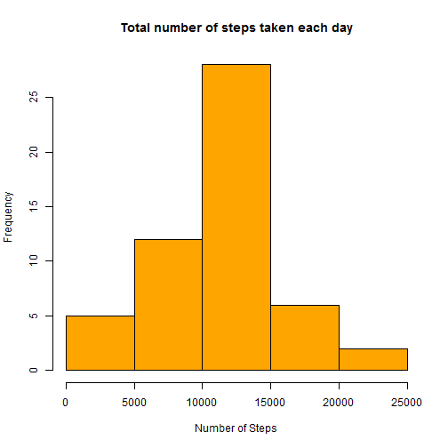
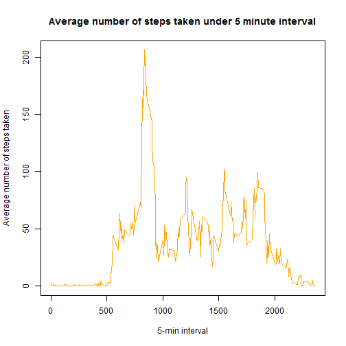
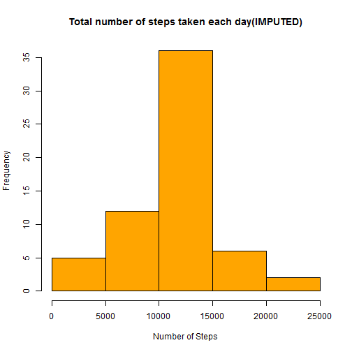
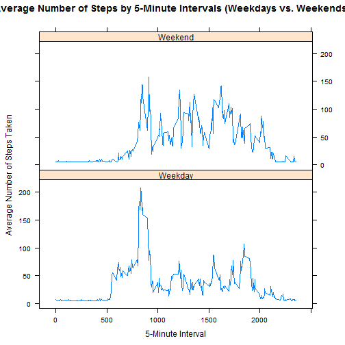

Reproducible Research Peer Graded Assignment 1
==============================================
###Loading and Pre-Processing the Data
Load and Pre-Process the Data


```r
activity <- read.csv("activity.csv")
##transform the date column into Date format
activity$date <- as.Date(activity$date, "%Y-%m-%d")
```

###What is mean total number of steps taken per day?
We will plot the **histogram** of total number of steps and find its ***mean*** and ***median***

```r
totalsteps <- aggregate(steps ~ date, data = activity, sum)
hist(totalsteps$steps, col = "orange", main = "Total number of steps taken each day", xlab = "Number of Steps")
```



```r
totmean <- format(mean(totalsteps$steps), nsmall = 3)
totmedian <- median(totalsteps$steps)
```
The mean of total number of steps taken per day is **10766.189** & the median is **10765**

###What is the average daily activity pattern?
We will plot a ***Time Series plot*** representing ***The average daily activity pattern***

```r
activitypt <- aggregate(steps ~ interval, data = activity, mean)
plot(activitypt$interval, activitypt$steps, col = "orange", main = "Average number of steps taken under 5 minute interval", xlab = "5-min interval", ylab = "Average number of steps taken", type = "l")
```



###Imputing missing values
The number of ***Missing values*** in the dataset are **2304**

Device a strategy to replace the NA's inside the dataset with the mean of the steps column.

```r
activity_impute <- activity
napos <- which(is.na(activity_impute$steps))
actmean <- rep(mean(activity_impute$steps, na.rm = TRUE),
          times = length(napos))
activity_impute[napos, "steps"] <- actmean
```
**The new imputed Data set is as follows**

```
##     steps       date interval
## 1 37.3826 2012-10-01        0
## 2 37.3826 2012-10-01        5
## 3 37.3826 2012-10-01       10
## 4 37.3826 2012-10-01       15
## 5 37.3826 2012-10-01       20
## 6 37.3826 2012-10-01       25
```
We will plot the **histogram** of total number of steps of the **Imputed data** and find the ***new mean*** & the ***new median***

```r
totalsteps1 <- aggregate(steps ~ date, data = activity_impute, sum)
hist(totalsteps1$steps, col = "orange", main = "Total number of steps taken each day(IMPUTED)", xlab = "Number of Steps")
```



```r
totmean1 <- format(mean(totalsteps1$steps), nsmall = 3)
totmedian1 <- format(median(totalsteps1$steps), nsmall = 3)
```
The ***Original values*** for 

**Mean** : 10766.189

**Median** : 10765

The ***Imputed values*** for

**Mean** : 10766.189

**Median** : 10766.189

###Are there differences in activity patterns between weekdays and weekends?
Let us create a column named daytype which tells us whether the day is a *weekday* or a *weekend*

```r
activity_impute$daytype <- ifelse(weekdays(activity_impute$date) %in% c("Saturday", "Sunday"), "Weekend", "Weekday")
activitypt1 <- aggregate(steps ~ interval + daytype, data = activity_impute, mean)
```

Now, lets make a panel plot containing a **time series plot** of the 5-minute interval & the average number of steps taken.

```r
library(lattice)
xyplot(steps ~ interval | daytype, data = activitypt1, type = "l", layout = c(1,2), xlab="5-Minute Interval", ylab = "Average Number of Steps Taken", main="Average Number of Steps by 5-Minute Intervals (Weekdays vs. Weekends)")
```


